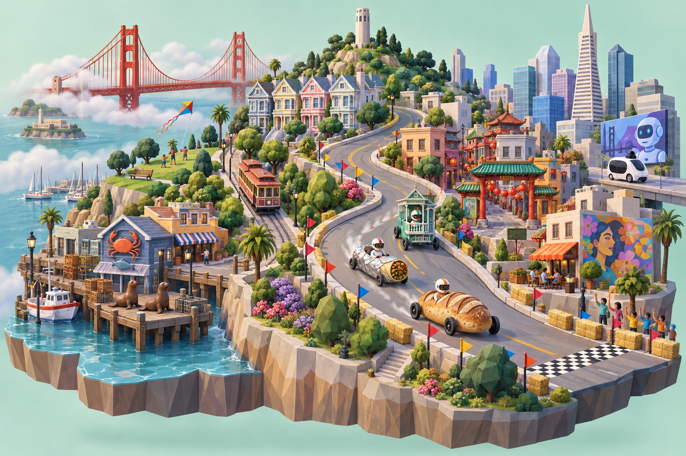
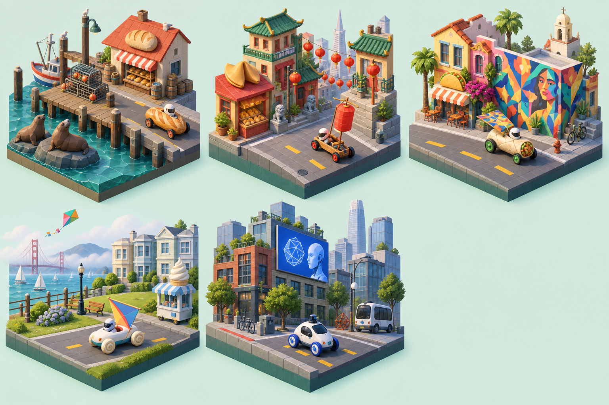
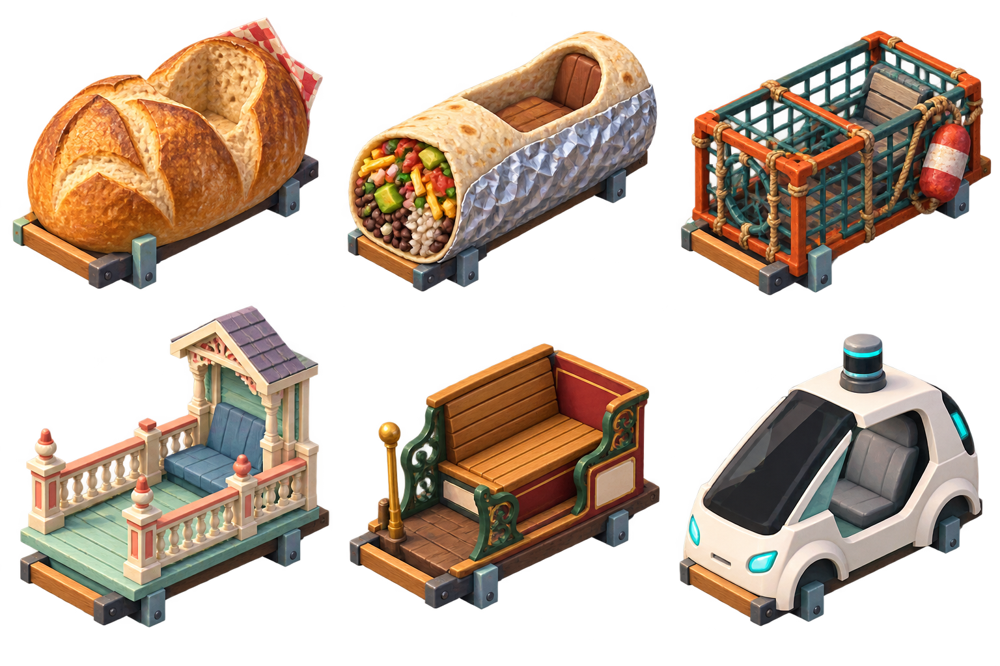
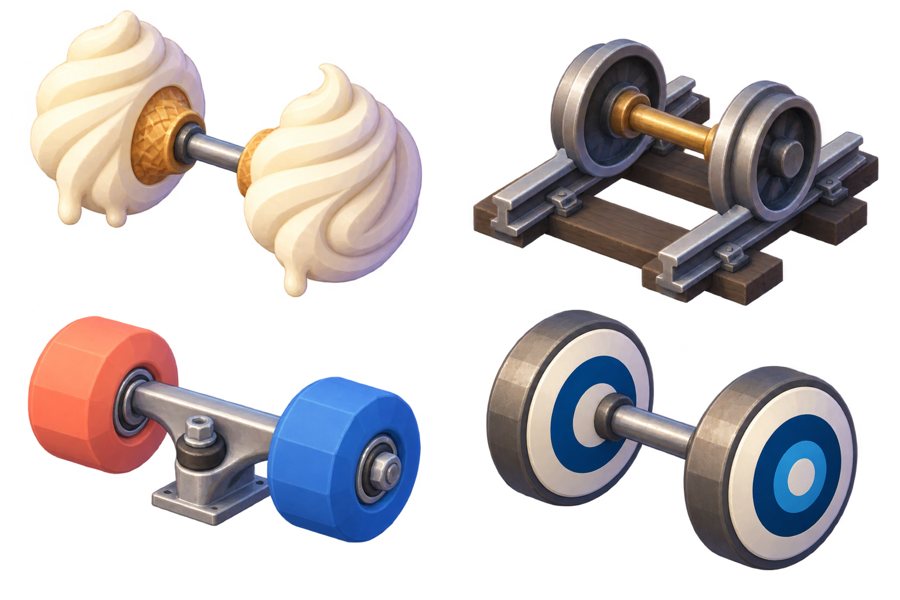
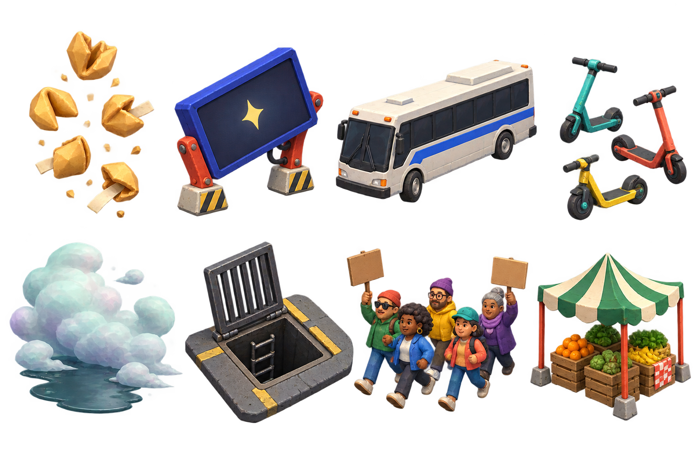

# SF Derby — imported concept art

All six original PNGs were imported on September 8, 2026 from [Generate SF game art assets](https://chatgpt.com/s/cx_6aa06772bee081919c2e91c464c97f82). They are saved unmodified at 1536 × 1024. The source manifest includes the shared asset URL, dimensions, size, and SHA-256 for each file.

These are raster concept references. Modular 3D chassis, rotating wheels, animated gadgets, and collision behavior still require the game's Blender/Three.js production work. The four part/prop sheets contain alpha transparency (verified range 0–254); the city and neighborhood sheets are opaque. The part sheets also contain translucent shading around the objects, so individual clean selection thumbnails still need production work.

[Customization specification](../../SILICON_VALLEY_RACER_CUSTOMIZATION.md)

## Cityscape

## Five neighborhood kits

Wharf, Chinatown, Mission, Marina, and SoMa, with matching local racers.

## Six chassis without wheels

Top row: sourdough loaf, Mission burrito, crab pot. Bottom row: Victorian porch, cable-car bench, driverless pod.

## Wheel and contact concepts

Soft-serve wheels, rail contact, skateboard wheels, and transit discs. The customization specification selects a smaller launch set and adds scooter wheels based on the existing game model.

## Gadget concepts

Fog sail, kite wing, fireboat pump, cookie airbrake, AI billboard thruster, sea-lion horn, lantern sail, and mural wing.

## Track props and hazards

Cookie rain, hinged billboard, tech shuttle, scooters, fog, open grate, marchers, and market tent. These images do not mean each depicted object is a proposed collidable obstacle.

The shared page displayed hazards as image 5 and gadgets as image 6. Local filenames follow the content and original prompt headings instead of display order.
